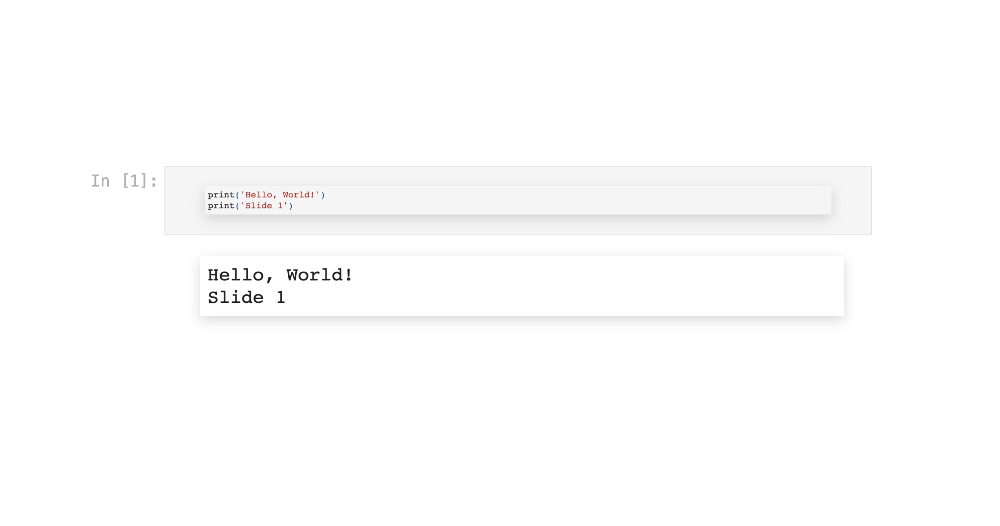

# How to automate your presentations with full HTML, dynamic values, and interactive charts

This is the code for the article on SlideModel.com explaining [how to create automated presentations](https://slidemodel.com/automate-presentations-with-dynamic-values-and-interactive-charts/).

We start with a very simple "Hello, world" example:

and work our way to a more elaborate presentation with dynamic values from a Twitter tweets dataset, and interactive charts allowing our reders to generate their own custom charts:

